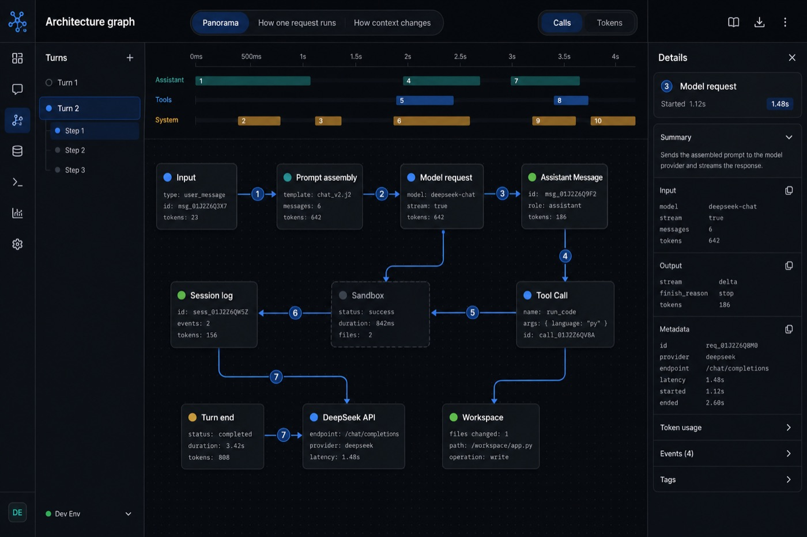
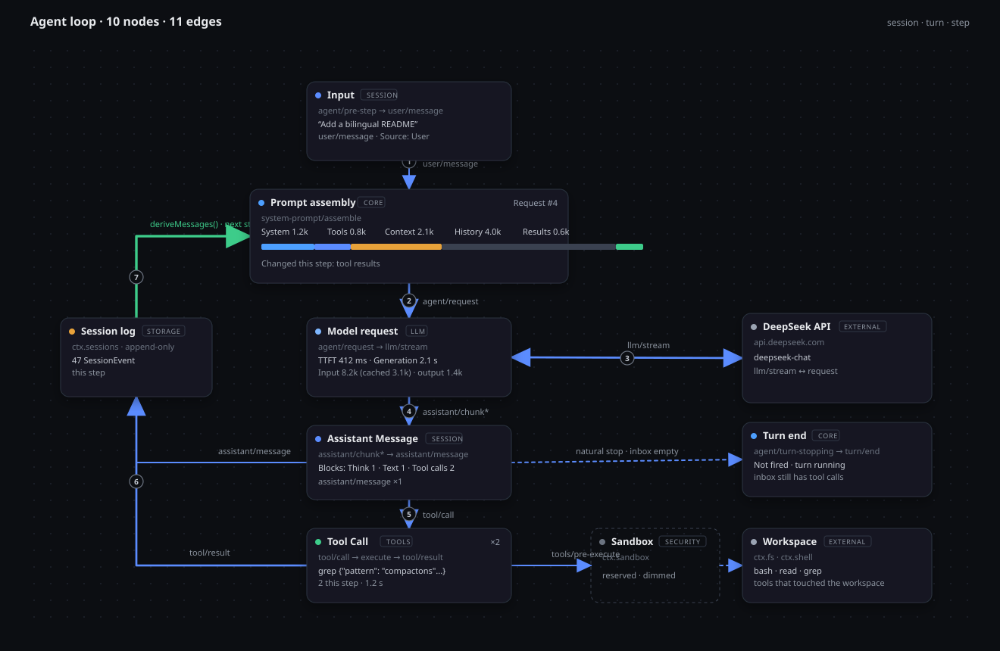

# dsh-trajectory-graph

English | [简体中文](README.zh-CN.md)

[](#license)
[](https://github.com/deepseek-ai/deepseek-harness)
[](https://github.com/Moi-ginger/dsh-trajectory-graph)

An **Architecture** tab for [DeepSeek Harness](https://github.com/deepseek-ai/deepseek-harness). It draws one session's agent loop as a live diagram: ten nodes, eleven edges, scope-driven card readings, animated edge traffic, a Trajectory-style timeline, and a per-node details drawer.

Chat shows the transcript. Trajectory shows the event ledger. Architecture shows **how the loop is wired** — and what the current session, turn, or step is doing on each wire.

<p align="center">
  
</p>

<p align="center"><sub>Architecture sits beside Chat and Trajectory. Select a session, a turn, or a step to re-read every card, reband every edge, and refocus the timeline.</sub></p>

## Introduction

DeepSeek Harness (`dsh`) is an all-plugin agent runtime. Its web client already ships Chat and Trajectory. This plugin adds a third conversation view that projects the same Trajectory snapshot onto a **fixed topology** of the agent loop.

The topology does not grow with the session. Ten nodes and eleven edges stay put for the life of the tab. What changes is the reading: badges, corner flags, token bars, stroke weights, and which nodes stay bright. Pick Full session, one turn, or one step — every pane follows that scope together.

Use it when you want to answer questions the transcript does not: which assemble sources grew this step, whether the turn can end, how heavy the `llm/stream` hop was, or which tool names actually touched the workspace.

## Topology

The compile-time graph. Sample card text below is illustrative; live readings come from the session log.

<p align="center">
  
</p>

| Node | Kind | Source |
| --- | --- | --- |
| Input | session | `agent/pre-step → step/start → user/message` |
| Prompt assembly | core | `system-prompt/assemble` |
| Model request | llm | `agent/request → llm/stream` |
| Assistant Message | session | `assistant/chunk* → assistant/message` |
| Tool Call | tools | `tool/call → pre → execute → post → tool/result` |
| Session log | storage | `ctx.sessions` · append-only |
| Turn end | core | `agent/turn-stopping → turn/end` |
| DeepSeek API | external | `api.deepseek.com` |
| Sandbox | security | `ctx.sandbox` (reserved, stays dimmed) |
| Workspace | external | `ctx.fs · ctx.shell` |

Numbered edges 1–7 are the hot path of one step. The green `deriveMessages() · next step` edge is the loop-back: tool results land in the session log and wake the next assemble. Dashed edges are the quiet exits — natural stop when the inbox is empty, and the reserved sandbox → workspace hop.

## Features

- **Three scopes** — Full session, one turn, or one step drive the cards, edges, rail, timeline, and drawer together. The latest turn is selected by default.
- **Card readings** — each node leads with the recorded invocation or reply (for example `grep {"pattern": …}`), plus badges, corner flags, a meta row, and a closing row. Prompt assembly shows five sources over a proportional token bar and highlights only the sources that brought in new material.
- **Edge traffic** — `Calls` / `Tokens` rebands the eleven stroke widths against the heaviest edge in scope. Live edges carry an animated flow trace.
- **Timeline** — Trajectory gestures: brush-to-scope, click a span to narrow, wheel zoom, right-drag pan, hover tooltip, `Equal width` / `Actual duration`, and earlier-history paging.
- **Details drawer** — per-node collapsible groups. A row that carries a tool `callId` jumps into the Trajectory view instead of duplicating its inspector.
- **Layout** — drag a node onto the 10-pixel grid; positions persist per user. Restore default layout after a node leaves its compile-time placement.
- **View modes** — Panorama, How one request runs, and How context changes dim nodes outside that set. Replay steps walks the selected turn at 800 ms per step.
- **Bilingual UI** — the tab follows the web client's locale (`zh` / `en`).

## Install

Requires DeepSeek Harness with the web profile.

```sh
dsh plugin --profile web add "github:Moi-ginger/dsh-trajectory-graph#main"
```

Restart the web UI, then open the **Architecture** tab in the conversation view (it appears after Chat and Trajectory):

```sh
dsh web
```

`dsh plugin` forwards to pnpm, so npm, `file:`, `link:`, and tarball specs also work:

```sh
dsh plugin --profile web add ./dsh-trajectory-graph-0.1.0.tgz
dsh plugin --profile web add link:/path/to/dsh-trajectory-graph
```

## Usage

1. Run a session in the web client so Trajectory has events to project.
2. Open **Architecture**.
3. Pick a turn in the left rail, or **Full session** in the footer.
4. Expand a turn and click a step to pin every reading to that step.
5. Click a node for its details drawer. Tool-call rows open Trajectory at that `callId`.
6. Switch **Calls** / **Tokens** when you care about hop volume versus token mass.
7. Brush the timeline to widen the scope to the narrowest range that covers the selection.

## Build

The committed `lib/` is prebuilt, so installation needs no build step. To rebuild from source:

```sh
pnpm install
pnpm run build
```

The build is self-contained: it bundles `src/client` with esbuild and compiles `*.module.css` with lightningcss, without any monorepo project references.

## Requirements

- DeepSeek Harness with the web profile (`@deepseek-ai/dsh-base` plus the in-box web client).
- The `ui-conversation` and `ui-trajectory` in-box plugins (they declare the `conversation.view` slot and the `trajectory` target this view consumes).

## Limitations

The graph topology is compile-time. Session data changes readings, brightness, and chrome — not node or edge count.

- Assistant cards report `assistant/message` counts: Trajectory merges chunks into messages.
- Workspace operations are named by the tools that touched `ctx.fs` / `ctx.shell`.
- Sandbox stays dimmed: the client has no signal that `ctx.sandbox` is mounted.

## License

MIT
