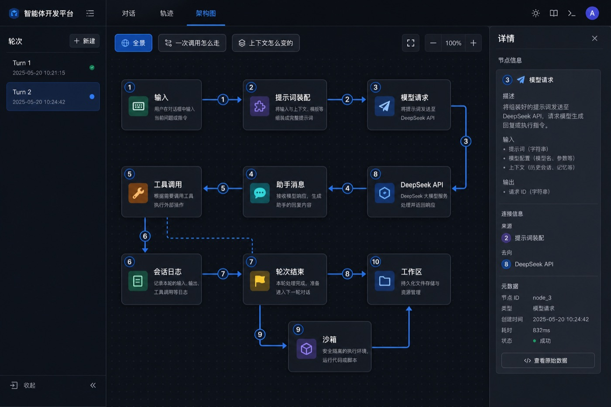
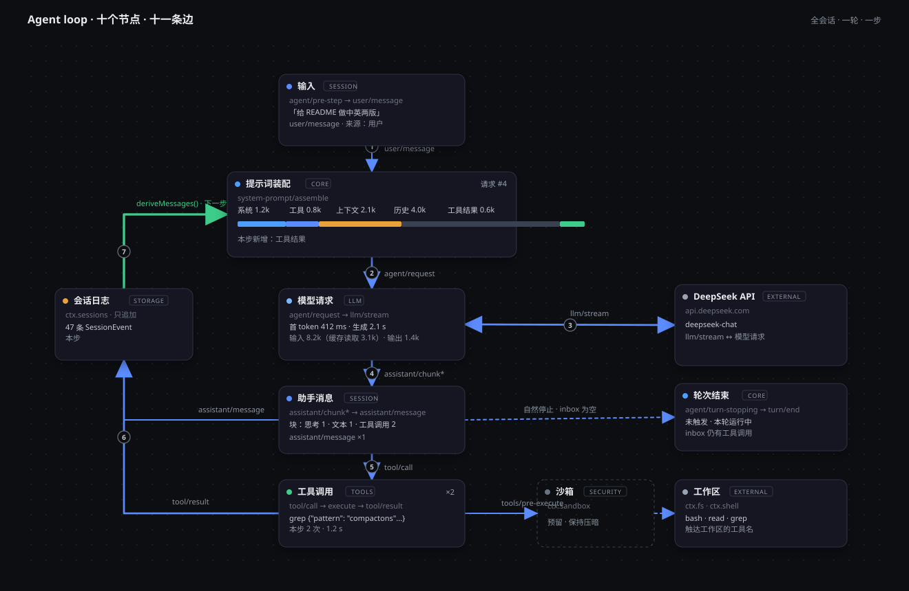

# dsh-trajectory-graph

[English](README.md) | 简体中文

[](#license)
[](https://github.com/deepseek-ai/deepseek-harness)
[](https://github.com/Moi-ginger/dsh-trajectory-graph)

[DeepSeek Harness](https://github.com/deepseek-ai/deepseek-harness) 的**架构图**会话视图。它把一次会话的 agent loop 画成实时图：十个节点、十一条边、随作用域变化的卡片读数、带动画的链路流量、一条 Trajectory 手势的时间线，以及按节点打开的详情面板。

「对话」展示逐条文本，「轨迹」展示事件账本，「架构图」展示 **loop 怎么接线**——以及当前会话、某一轮、某一步在每条线上正在发生什么。

<p align="center">
  
</p>

<p align="center"><sub>架构图是对话与轨迹旁边的第三个视图。选中全会话、某一轮或某一步，所有卡片、边宽与时间线会一起重读。</sub></p>

## 简介

DeepSeek Harness（`dsh`）是全插件的 agent 运行时。Web 客户端已内置「对话」与「轨迹」。本插件再加第三个会话视图，把同一份 Trajectory 快照投影到 agent loop 的**固定拓扑**上。

拓扑不会随会话变大。十个节点与十一条边在标签页生命周期内保持固定。会变的是读数：徽章、角标、token 色条、边的粗细，以及哪些节点保持高亮。选「全会话」、某一轮或某一步——所有窗格跟同一档作用域走。

适合用来回答文本记录答不上的问题：这一步哪些装配来源变长了、这一轮能不能结束、`llm/stream` 这一跳有多重、哪些工具名真正碰到了工作区。

## 拓扑

编译期图。下图卡片上的示例读数仅作示意；线上读数来自会话日志。

<p align="center">
  
</p>

| 节点 | 类型 | 来源 |
| --- | --- | --- |
| 输入 | session | `agent/pre-step → step/start → user/message` |
| 提示词装配 | core | `system-prompt/assemble` |
| 模型请求 | llm | `agent/request → llm/stream` |
| 助手消息 | session | `assistant/chunk* → assistant/message` |
| 工具调用 | tools | `tool/call → pre → execute → post → tool/result` |
| 会话日志 | storage | `ctx.sessions` · 只追加 |
| 轮次结束 | core | `agent/turn-stopping → turn/end` |
| DeepSeek API | external | `api.deepseek.com` |
| 沙箱 | security | `ctx.sandbox`（预留，保持压暗） |
| 工作区 | external | `ctx.fs · ctx.shell` |

编号 1–7 是一步的热路径。绿色的 `deriveMessages() · 下一步` 是回环：工具结果落入会话日志，唤醒下一次装配。虚线边是安静出口——inbox 为空时的自然停止，以及预留的沙箱 → 工作区 hop。

## 功能

- **三档作用域** — 全会话、某一轮、某一步同时驱动卡片、边、轮次轨、时间线与详情面板。默认选中最新一轮。
- **卡片读数** — 每个节点先给出记录下来的调用或回复（例如 `grep {"pattern": …}`），再加徽章、角标、读数行与末行。提示词装配用五段来源与按占比分段的 token 色条，只高亮本作用域内确有新内容进入的来源。
- **链路流量** — 「调用数」/「Token」按当前作用域最重的边重新分档十一条边的粗细。活跃边上有流动动画。
- **时间线** — 沿用轨迹手势：框选放宽作用域、单击片段收窄、滚轮缩放、右键拖动平移、悬停提示、「等宽」/「实际时长」，以及加载更早历史。
- **详情面板** — 按节点折叠分组。带工具 `callId` 的行会跳进轨迹视图，而不是在这里重复检查器。
- **布局** — 拖动节点会吸附到 10 像素网格，位置按用户持久化。节点离开默认位置后可「恢复默认布局」。
- **视图模式** — 「全景」「一次调用怎么走」「上下文怎么变的」会压暗该集合之外的节点。「按步骤回放」以每步 800 ms 走过选中轮次。
- **中英界面** — 标签页跟随 Web 客户端的 locale（`zh` / `en`）。

## 安装

需要带 web profile 的 DeepSeek Harness。

```sh
dsh plugin --profile web add "github:Moi-ginger/dsh-trajectory-graph#main"
```

重启 Web UI，然后在会话视图中打开**架构图**标签页（出现在「对话」与「轨迹」之后）：

```sh
dsh web
```

`dsh plugin` 会把参数转发给 pnpm，因此 npm、`file:`、`link:` 与 tarball 也可以：

```sh
dsh plugin --profile web add ./dsh-trajectory-graph-0.1.0.tgz
dsh plugin --profile web add link:/path/to/dsh-trajectory-graph
```

## 使用

1. 先在 Web 客户端跑一次会话，让轨迹里有可投影的事件。
2. 打开**架构图**。
3. 在左侧轮次轨选一轮，或点底部的**全会话**。
4. 展开一轮并点某一步，把所有读数钉在该步上。
5. 点击节点打开详情面板。工具调用行会按 `callId` 打开轨迹。
6. 关心 hop 次数时选「调用数」，关心 token 质量时选「Token」。
7. 在时间线上框选，作用域会放宽到覆盖所选片段的最窄一档。

## 构建

已提交的 `lib/` 是预构建产物，安装不需要再编译。从源码重建：

```sh
pnpm install
pnpm run build
```

构建是自包含的：用 esbuild 打包 `src/client`，用 lightningcss 编译 `*.module.css`，不依赖任何 monorepo project references。

## 依赖

- 带 web profile 的 DeepSeek Harness（`@deepseek-ai/dsh-base` 与内置 web 客户端）。
- 内置的 `ui-conversation` 与 `ui-trajectory` 插件（它们声明本视图消费的 `conversation.view` 槽位与 `trajectory` target）。

## 限制

图拓扑是编译期的。会话数据改变读数、亮度与控件，不改变节点或边的数量。

- 助手卡片报告 `assistant/message` 计数：Trajectory 快照会把 chunk 合并成消息。
- 工作区操作按触达 `ctx.fs` / `ctx.shell` 的工具名标识。
- 沙箱保持压暗：客户端没有 `ctx.sandbox` 已挂载的信号。

## License

MIT
